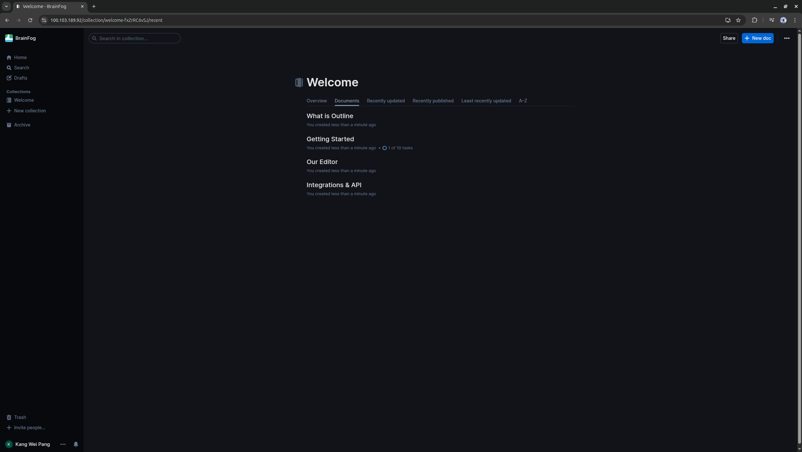

# Wiki
This project is a self-hosted, fully customizable personal knowledge base with seamless access across devices. With Tailscale VPN integration, the knowledge base remains securely accessible from any location — without exposure to the public internet. The setup provides a secure and responsive workspace, hosted entirely on private infrastructure.

## Installation
Please refer to the [installation guide](/docs/INSTALLATION.md) for detailed instructions on setting up the Outline wiki.

## Running the packages
Please refer to the [running guide](/docs/RUN.md) for detailed instructions on accessing the wiki.